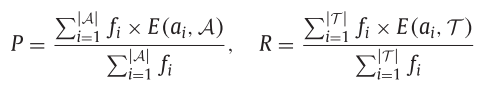
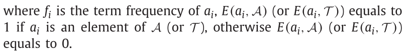
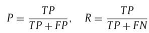
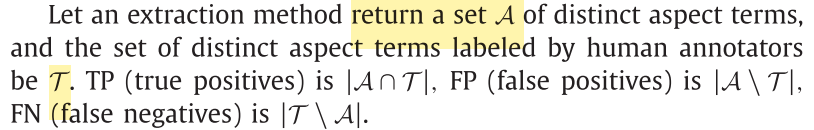
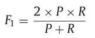
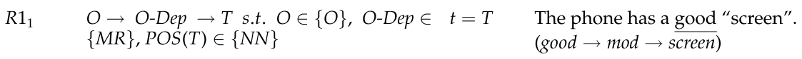
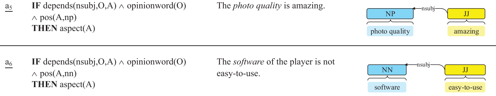
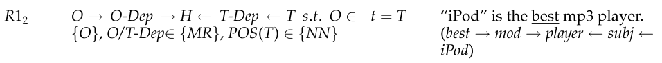
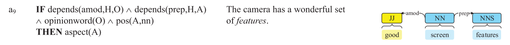
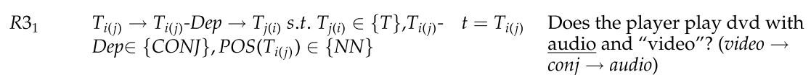

# domain-specific target extraction

## `source`: Shortest path in a dependency graph

### Environment
* Ubuntu 16.04
* Python 3.7.0

### Setup
`pip install -r requirements.txt`
```python
import stanfordnlp, nltk
stanfordnlp.download('en')
nltk.download('averaged_perceptron_tagger')
```

### Dataset description
| Data |     Product     | # of Sentences | # of Aspects |
|:----:|:---------------:|:--------------:|-------------:|
|  D1  |  Digital camera |            597 |          218 |
|  D2  |  Digital camera |            346 |          147 |
|  D3  |    Cell phone   |            540 |          268 |
|  D4  |    MP3 player   |          1,690 |          622 |
|  D5  |    DVD player   |            730 |          286 |
|  D6  |     Computer    |            526 |          313 |
|  D7  | Wireless router |            877 |          272 |
|  D8  |     Speaker     |            689 |          388 |

### References
* Customer review dataset & Sentiment lexicon for customer reviews
    - Qiu, G., Liu, B., Bu, J., & Chen, C. (2011). Opinion word expansion and target extraction through double propagation. Computational linguistics, 37(1), 9-27.
    - [Customer review dataset: uic.edu](https://www.cs.uic.edu/~liub/FBS/sentiment-analysis.html#datasets)
    - [Customer review dataset parser (csv -> json): chakki-works](https://github.com/chakki-works/chazutsu/blob/7eea1f6b441db62ec76f64da1c041cb931746907/chazutsu/datasets/customer_review.py)
    - [Sentiment lexicon for customer reviews: uic.edu](https://www.cs.uic.edu/~liub/FBS/sentiment-analysis.html#lexicon)

* Learning syntactic patterns from dependency graphs
    - Hassan, Mohsen, et al. "Extracting disease-symptom relationships by learning syntactic patterns from dependency graphs." 2015.

* Evaluation measures 
    - Liu, Q., Gao, Z., Liu, B., & Zhang, Y. (2015, June). Automated rule selection for aspect extraction in opinion mining. In Twenty-Fourth International Joint Conference on Artificial Intelligence.

### Evaluation measures
* Precision and recall based on multiple occurences
    > In a dataset, an important aspect often occurs many times, e.g., the aspect “picture” occurred 10 times in a set of camera reviews. If any occurrence of “picture” is extracted, then all occur- rences of “picture” are considered extracted, i.e., 10. If none of its occurrences is extracted, it is considered as 10 losses.
    
    - </img></img>

* Precision and recall based on distinct occurence
    > if any occurrence of “picture” is extracted, it is considered as one extrac- tion. If none is extracted, it is considered as one loss.
    
    - </img></img>

* F1 score
    - </img>
    
## `source_archive/source_dp`: Double propagation rules 

#### Type 1 rules (given a set of seed opinion words -> new targets): R11, R12
> using opinion words to extract aspects (based on some dependency relations between them), **given a set of of seed opinion words a priori**. For example, specific rules that are instantiations of rule patterns **R11 and R12** are type 1 rules.

##### R11: `O(JJ) ~ MR <- T(NN)` or `O(JJ) -> MR ~ T`
- The phone has a good **screen**.
- The **photo quality** is amazing.
- The **software** of the player is not easy-to-use.
- I am not pleased with the **picture quality**. 
</img></img></img></img>

##### R12: `O(JJ) ~ MR <- H -> MR ~ T(NN)`
- The **iPod** is the best mp3 player.
- The camera has a wonderful set of **features**. 
</img></img>

#### Type 2 rules (using known targets -> new targets): R31, R32
> **using known aspects** to extract new aspects. The known aspects are extracted in the previous propagation. For example, specific rules that are instantiations of rule patterns **R31 and R32** are type 2 rules.

##### R31: `T(NN) ~ CONJ <- T(NN)` 
- Does the player play dvd with **audio** and *video*?
</img></img>

### Annotation
* O: opinion words
    - POS tags for O: JJ, JJR, JJS
* T: targets
    - POS tags for T: NN, NNS
* H: any word
* O|T-Dep: Dependency relation
    - {MR}: mod, pnmod, subj, s, obj, obj2, desc
    - {CONJ}: conj

### References
* Double propagation rules
    - [NinaTian98369](https://github.com/NinaTian98369/Double-propagation/blob/master/extract_targets_dp_new_final.py)
    - [opener-project (Java)](https://github.com/opener-project/double-propagation-target-generation/tree/master/src/main/java/org/openerproject/double_propagation2/algorithm/rules)
    - [opener-project (Java)](https://github.com/opener-project/double-propagation-target-generation/blob/master/src/main/java/org/openerproject/double_propagation2/model/RelationTypes.java)

<!--
## Obsolete
* MDSD dataset
    - https://www.cs.jhu.edu/~mdredze/datasets/sentiment/
* MDSD datset parser (xml -> json)
    - https://github.com/robbymeals/word_vectors/blob/d829159e017695eb716413a02e3eee78fb86de25/src/mdsd2json.py
-->
